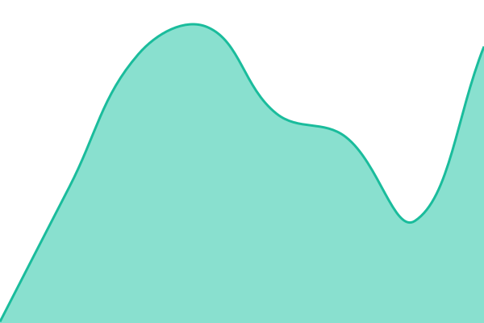
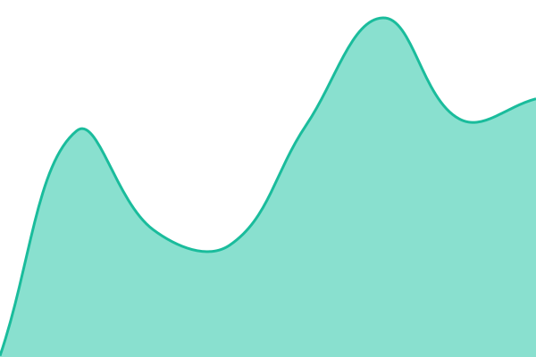

# [📈 Live Status](https://renchix.github.io/catego-status): <!--live status--> **🟩 All systems operational**

This repository contains the open-source uptime monitor and status page for [renchix](https://renchix.github.io/catego-status), powered by [Upptime](https://github.com/upptime/upptime).

With [Upptime](https://upptime.js.org), you can get your own unlimited and free uptime monitor and status page, powered entirely by a GitHub repository. We use [Issues](https://github.com/renchix/catego-status/issues) as incident reports, [Actions](https://github.com/renchix/catego-status/actions) as uptime monitors, and [Pages](https://renchix.github.io/catego-status) for the status page.

<!--start: status pages-->
<!-- This summary is generated by Upptime (https://github.com/upptime/upptime) -->
<!-- Do not edit this manually, your changes will be overwritten -->
<!-- prettier-ignore -->
| URL | Status | History | Response Time | Uptime |
| --- | ------ | ------- | ------------- | ------ |
|  [Catego AIS API](https://ais.catego.app/health) | 🟩 Up | [catego-ais-api.yml](https://github.com/renchix/catego-status/commits/HEAD/history/catego-ais-api.yml) | 

 616ms
     
 | 

<a href="https://status.catego.app/history/catego-ais-api">100.00%</a>
    

|  [AIS Admin Portal](https://ais-portal.catego.app) | 🟩 Up | [ais-admin-portal.yml](https://github.com/renchix/catego-status/commits/HEAD/history/ais-admin-portal.yml) | 

 168ms
     
 | 

<a href="https://status.catego.app/history/ais-admin-portal">100.00%</a>
    

|  [AIS Auth Gateway (PSU frontend)](https://connect.catego.app) | 🟩 Up | [ais-auth-gateway-psu-frontend.yml](https://github.com/renchix/catego-status/commits/HEAD/history/ais-auth-gateway-psu-frontend.yml) | 

 148ms
     
 | 

<a href="https://status.catego.app/history/ais-auth-gateway-psu-frontend">100.00%</a>
    

|  [Catego Categorization Web cabinet](https://cabinet.catego.app) | 🟩 Up | [catego-categorization-web-cabinet.yml](https://github.com/renchix/catego-status/commits/HEAD/history/catego-categorization-web-cabinet.yml) | 

 218ms
     
 | 

<a href="https://status.catego.app/history/catego-categorization-web-cabinet">100.00%</a>
    

|  [Catego Categorization API](https://api.catego.app/health?check=1) | 🟩 Up | [catego-categorization-api.yml](https://github.com/renchix/catego-status/commits/HEAD/history/catego-categorization-api.yml) | 

 576ms
     
 | 

<a href="https://status.catego.app/history/catego-categorization-api">100.00%</a>
    

<!--end: status pages-->

[**Visit our status website →**](https://renchix.github.io/catego-status)

## 📄 License

- Powered by: [Upptime](https://github.com/upptime/upptime)
- Code: [MIT](./LICENSE) © [Anand Chowdhary](https://anandchowdhary.com)
- Data in the `./history` directory: [Open Database License](https://opendatacommons.org/licenses/odbl/1-0/)
